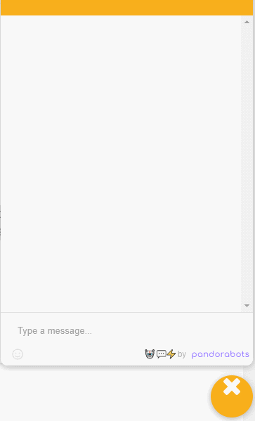

# Career Quiz ChatBot
A human-response simulation that gives career advice to students who are close to graduating with a computer science degree.  

  <kbd>
</img>
  </kbd>

 

The chatbot acts as a human response simulation to give career advice to students who are graduating with a computer science degree. The bot asks the student questions to identify their strengths in math, coding, and design to identify a suitable career choice. For those who don't match one of the five options, they are advised to meet with a career counselor.

### Installing the ChatBot:
1. Download chatBot.zip folder and unzip
2. Open https://home.pandorabots.com/ 
3. Click on "Sign In" (top left)
4. Create a new bot by clicking the + next to MY BOTS
5. Fill in the fields -- Name: (any), Language: English, Content: Blank Bot
6. Edit (dropdown) Code editor > AIML > UDC
7. File > Upload > Select Files
8. Upload the unzipped file (udc.aiml)
9. Click the yellow icon in the corner to open the bot
10. Start the bot by typing <kbd>start</kbd> and follow the prompts

### Future Updates:
<ul>
  <li>A more in-depth analysis with more career options.</li>
  <li>The ability to schedule an appointment from available times with a guidance counselor</li>
